# Introduction
This project documents how you can setup a complete Red Hat OpenShift 4.2 cluster on a single VMware ESXi host machine.  
  
The configuration files and scripts used for the installation are also maintained by this project.  
  
# Context and History
This project was created because we wanted to install Red Hat OpenShift on an existing lab machine that was running an end of support Windows Server 2008 O.S. and was no longer being used.  
At the time of writing, the OpenShift installation was only supported out of the box on:
- AWS
- Azure
- GCP
- bare metal
- OpenStack
- vSphere
  
For more details check https://docs.openshift.com/container-platform/4.2/welcome/index.html.  
  
We preferred to install a free base O.S. on our labo server to replace Windows Server 2008. The options we considered were:
- Linux
- VMWare ESXi (free version)  
  
At first sight the installation instructions for vSphere seem to correspond with our use case, but this setup requires VMware vSphere vCenter, managing your VMware vSphere machines. Our goal is to install Red Hat OpenShift on a single VMware ESXi machine, because this allows us to use the free VMware ESXi license, without a central vCenter server. Therefore the standard vSphere installation instructions can not be used.  
  
Another alternative we considered was [Red Hat CodeReady Containers](https://developers.redhat.com/products/codeready-containers/overview). This alternative needs further evaluation but was put on hold because:
- testing on a personal Windows laptop required Hyper-V, which would conflict with VirtualBox, our preferred hypervisor  
- a Linux server with matching requirements was not (yet) available  
- CodeReady does not contain all OpenShift features  
  
A similar existing VMWare ESXi environment was already available, which allowed us to design and validate the setup for the lab machine we wanted to migrate.  
  
# References
A quick search on the internet quickly returned a number of resources that provided the basis for our solution:
- [OpenShift Blog: Deploying a UPI environment for OpenShift 4.1 on VMs and Bare Metal](https://blog.openshift.com/deploying-a-upi-environment-for-openshift-4-1-on-vms-and-bare-metal/)  
- [OpenShift Documentation: Installing a cluster on bare metal](https://docs.openshift.com/container-platform/4.2/installing/installing_bare_metal/installing-bare-metal.html)  
  
# Pre-requisites
## Bare metal specs
The machine we used to perform the installation is a Dell PowerEdge R715 rackserver, with the following specs:
- 64GB Memory, DDR3, 1333MHz (16x4GB Dual Ranked RDIMMs)
- 2x AMD Opteron 6128, 8 Cores, 2.00GHz, 8x512K L2 Cache, 115W TDP
- 4 x 500GB, SATA, 2.5-in, 7.2K RPM Hard Drive (Hot Plug)
- Two Dual Port Embedded Broadcom NetXtreme II 5709 Gigabit Ethernet NIC with TOE & iSCSI
  
## VMWare ESXi
The installation was tested on VMware ESXi 6.5.0 (Dell-ESXi-6.5.0-4564106-A00 (Dell))  
  
# Solution Overview
The conceptual architecture of our single machine OpenShift cluster is depicted below:
  
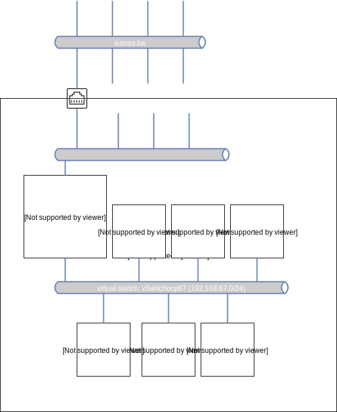
  

The following table summarizes the VMs that we use to deploy OpenShift:  
  
| VM name | Hostname | Role | CPU | RAM | Storage | IP Address |  
| --- | ---  | --- | --- | --- | --- | --- |  
| ocp67-bastion | bastion  | bastion | 1 | 2 | 20GB | 192.168.67.1 |  
 ocp67-bootstrap | bootstrap  | OpenShift Bootstrap | 2 | 2 | 40GB | 192.168.67.253 |  
| ocp67-master-0 | master-0  | OpenShift Control Plane | 2 | 8 | 40GB | 192.168.67.10 |  
| ocp67-master-1 | master-1  | OpenShift Control Plane | 2 | 8 | 40GB | 192.168.67.11 |  
| ocp67-master-2 | master-2  | OpenShift Control Plane | 2 | 8 | 40GB | 192.168.67.12 |  
| ocp67-cptnod-0 | cptnod-0  | OpenShift Compute Node | 8 | 16 | 80GB | 192.168.67.30 |  
| ocp67-cptnod-1 | cptnod-1  | OpenShift Compute Node | 8 | 16 | 80GB | 192.168.67.31 |  
  
The bastion server is a CentOS 8 VM.  
- Hostname: bastion.ocp67.i8c-lab-02.iconos.be
- IP address: 192.168.67.1
- Netmask: 255.255.255.0
- Gateway: 192.168.67.1
- DNS server: 192.168.67.1
- DNS domain: ocp67.i8c-lab-02.iconos.be  
  
It hosts the DNS server, DHCP server and load balancer for a 192.168.67.0 subnet that will be created with the Virtual Switch _vSwitchocp67_. It also hosts the TFTP and Matchbox servers to provision the OpenShift VMs. It also serves as gateway and router to the internet for the 192.168.67.0 subnet.  
  
To apply this solution to your environment, just replace all occurences of the hostname of our VMware lab server _i8c-lab-02.iconos.be_ to the name of your VMware lab server.  
  
# Configuration and Installation
## VMware ESXi Network
Use the VMware ESXi web console to create a dedicated vSwitch and Port Group for our OpenShift environment:  
### Create VMware ESXi vSwitch
Under the Networking left menu, add a standard Virtual Switch with the following properties:  
1) vSwitch Name = vSwitchocp67
2) remove the uplink (this switch is used for the internal OpenShift network and should access the internet via the bastion router)
3) accept all other default values
  
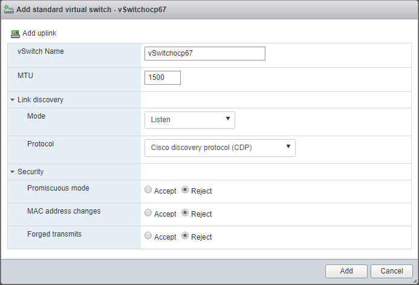
  
### Create VMware ESXi Port Group
Under the Networking left menu, add a Port Group with the following properties:  
1) Port Group Name = ocp67  
2) Virtual Switch = vSwitchocp67 (created in the previous section)
3) accept all other default values
  
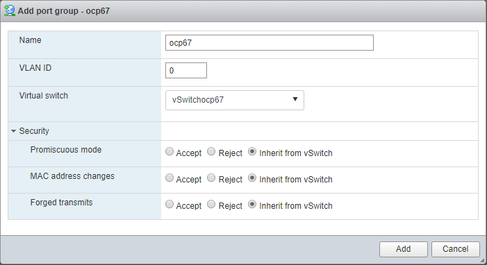
  
## Bastion VM
Use the VMware ESXi web console to perform the following configuration steps:
### Upload Operating System binary
On the bastion VM we'll install Centos 8 using the ISO image [CentOS-8-x86_64-1905-dvd1.iso](http://isoredirect.centos.org/centos/8/isos/x86_64/). Download the .iso file to your laptop first and then upload it to your VMware ESXi host via the Datastore browser under the Storage left menu item.  
  
### Create VM
 
Perform the following steps:  
1)  Select creation type  
    
     
    
2)  Specify the name (see table above) and guest OS  
    
      
    
3)  Select storage (which datastore you select is not important, just make sure it has sufficient free space for the storage defined in the table above)  
    
      
    
4)  Customize settings as defined in screen shot below. Make sure you:
    -  add 2 NICs (both with MAC address = Automatic):  
       1) the first one connected to a port group with an uplink to your network  
       2) the second one connected to the port group created in previous sections  
    -  connect the DVD to the CentOS .iso image uploaded to the VMware host in the previous section  
    
    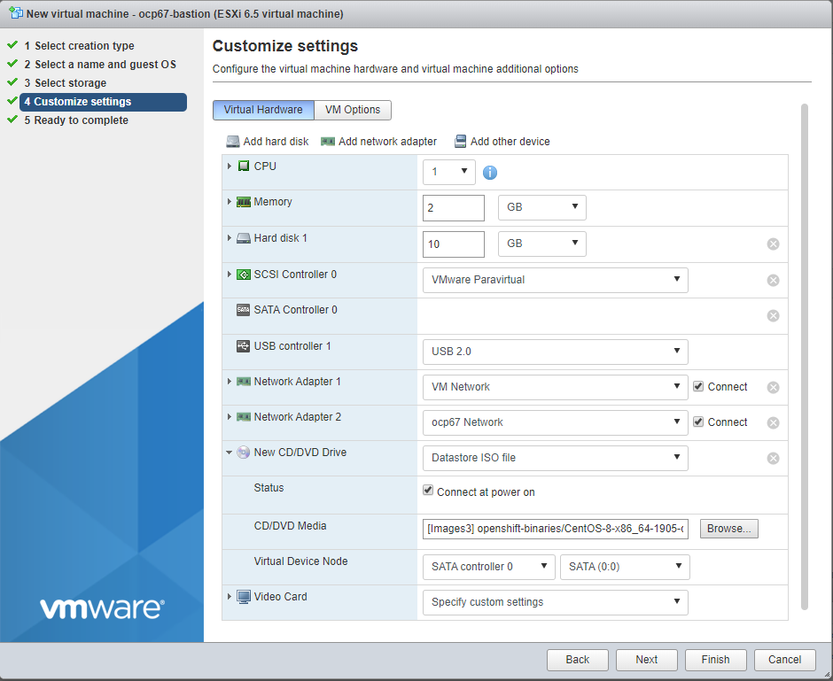  
    
  
Power on the machine and start the installation.  
TIP: Use the VMware Remote Console to connect your monitor, it allows you to correctly set your keyboard layout!  
  
1)  Start CentOS installation  
    
    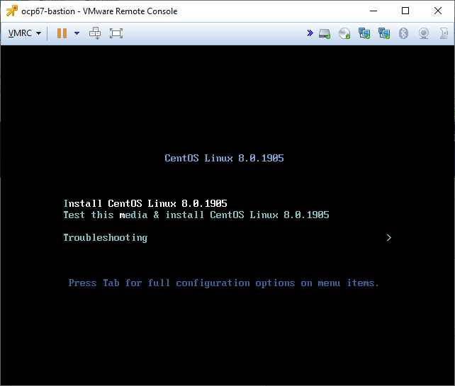  
    
2)  Select language and press Continue  
    
    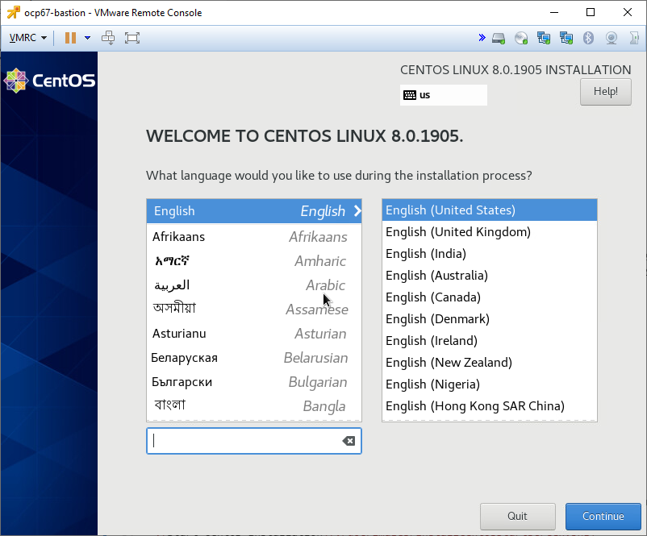  
    
3)  Select keyboard  
    
    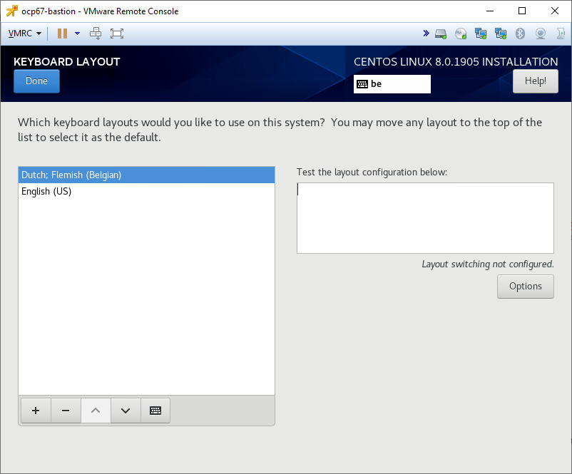  
    
4)  Enable a least the NIC connected to your public network and automatically assign an IP address to it using DHCP. We'll change the IP address to a static value later once the DNS server has been installed. Also change the hostname via this screen.      
    
    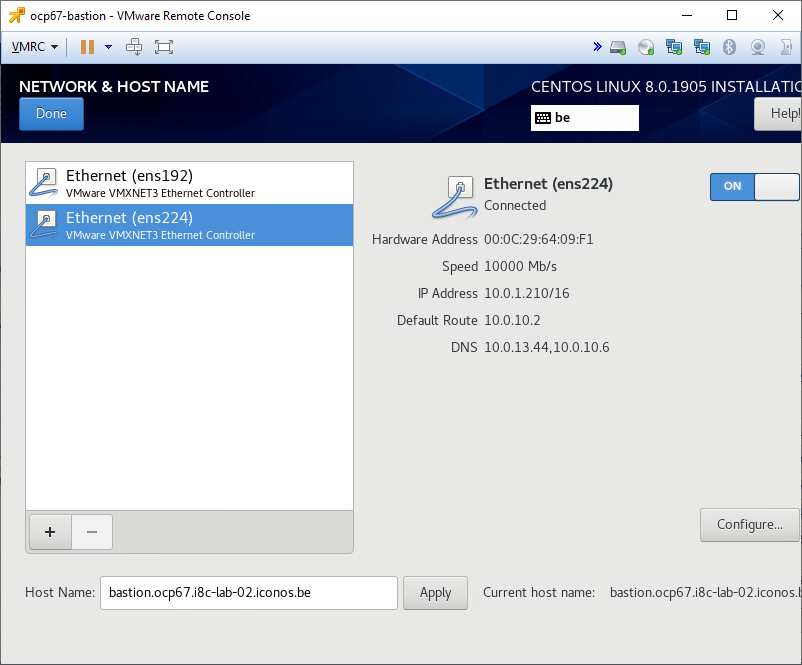  

5)  Confirm the installation destination    
    
    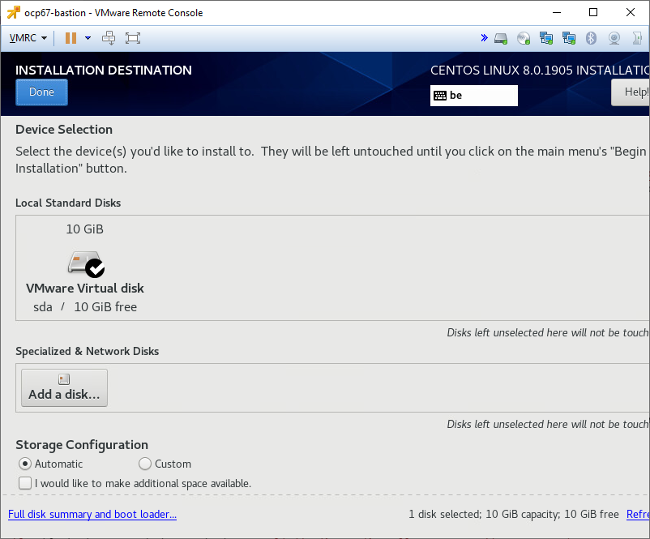  
    
6)  Set Date & Time
    
    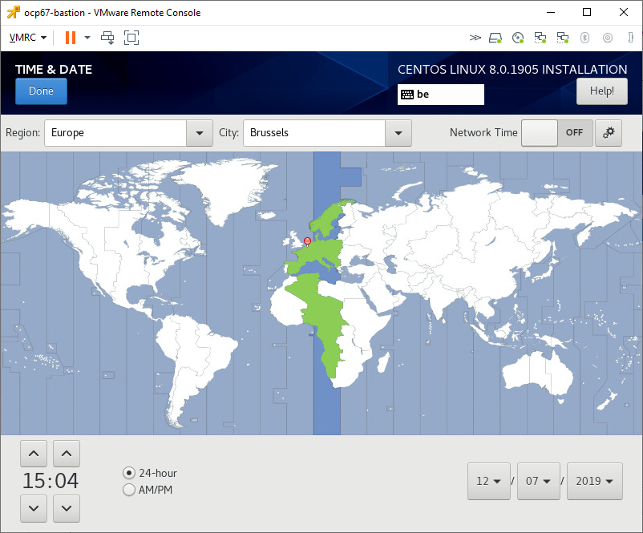  
    
7)  Begin installation  
    
    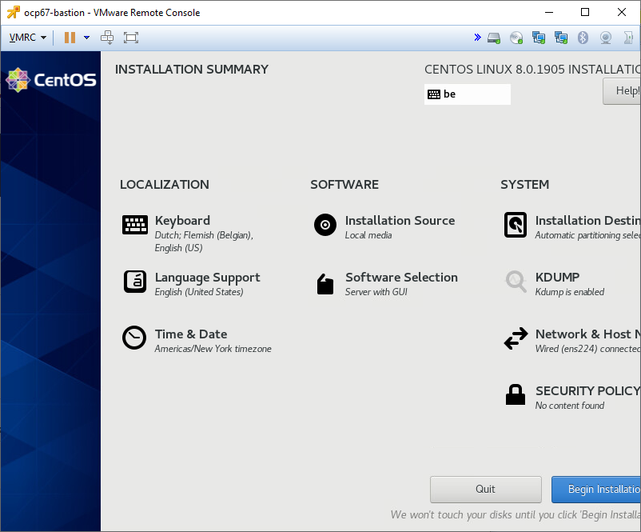  
    
8)  Configure user settings: set a password for root and create a user for yourself. Reboot once the installation is complete.  
    
    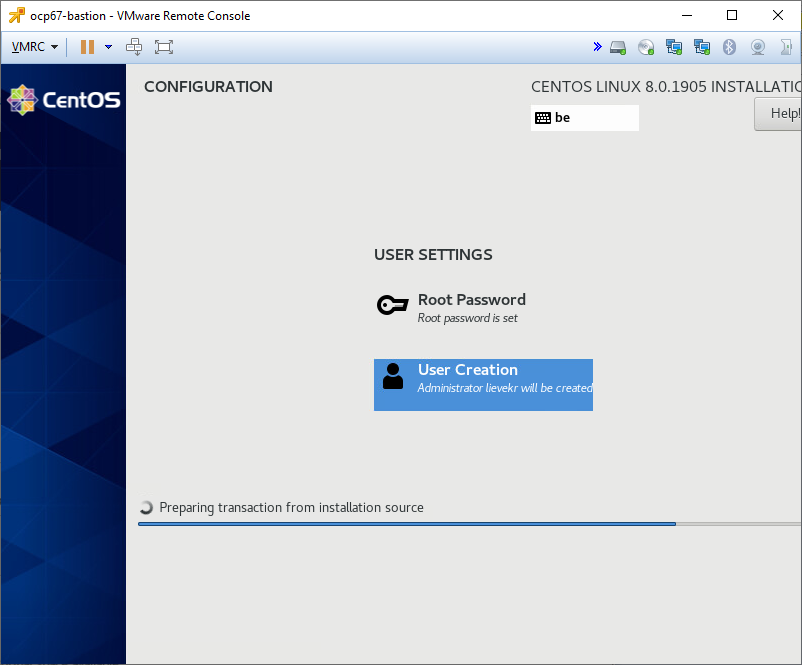  
    
9)  Accept the license once the system has rebooted and finish the configuration (will restart the system again).  
    
      
    
  
You should now be able to login to the system, either via the VMware Remote Console or via ssh.  
  
### Network and tools
Login as root on the bastion machine to perform the commands in the next sections.  
  
#### Configure the NIC connected to the VMware ESXi vSwitch vSwitchocp67
Define a static IP address for the NIC connected to the VMware ESXi vSwitch _vSwitchocp67_. Because the bastion server serves as a router for the network this NIC is connected to, the address ends in ".1":
```bash
# Obtain the list of network devices
nmcli
# look for the one connected to the VMware ESXi vSwitch "vSwitchocp67" = ens192 below
nmcli con add type ethernet con-name internal-static ifname ens192
nmcli con modify internal-static ipv4.addresses 192.168.67.1/24
nmcli con modify internal-static ipv4.gateway 192.168.67.1
nmcli con modify internal-static ipv4.dns 192.168.67.1
# avoid that the default route is assigned
nmcli con modify internal-static ipv4.never-default yes
nmcli con modify internal-static ipv4.method manual
nmcli con modify internal-static connection.autoconnect yes
# assign to the internal firewall zone, will enable masquerade
nmcli con modify internal-static connection.zone internal
# we don't need ipv6
nmcli con modify internal-static ipv6.method ignore
# apply changes
nmcli con up internal-static
# connect when not active
# nmcli device connect ens192
# Delete the old connection
nmcli con delete ens192

```
  
For more details check:
- https://developer.gnome.org/NetworkManager/stable/nmcli.html  
- https://www.linuxjournal.com/content/understanding-firewalld-multi-zone-configurations  
- https://firewalld.org/documentation/man-pages/firewall-cmd.html  
  
#### Install network services and installation tools
  
Install git, clone this project in the home folder of the root user and execute the installation script:  
```bash
dnf install -y git
cd ~
git clone https://gitlab.com/i8c/ibm/redhat/installing-openshift-on-single-vmware-esxi-host.git
cd installing-openshift-on-single-vmware-esxi-host
./installBastion.sh
```
  
The haproxy service will fail to start as it is not yet resolving against the DNS on our bastion router.  
Make sure the DNS service is up and running as we are going to assign it to our NIC in the external zone.  
```bash
[root@bastion ~]# systemctl status named-chroot
● named-chroot.service - Berkeley Internet Name Domain (DNS)
   Loaded: loaded (/usr/lib/systemd/system/named-chroot.service; enabled; vendor preset: disabled)
   Active: active (running) since Wed 2019-11-27 16:55:42 EST; 10min ago
  Process: 1079 ExecStart=/usr/sbin/named -u named -c ${NAMEDCONF} -t /var/named/chroot $OPTIONS (code=exited, status=0/SUCCESS)
  Process: 1034 ExecStartPre=/bin/bash -c if [ ! "$DISABLE_ZONE_CHECKING" == "yes" ]; then /usr/sbin/named-checkconf -t /var/named/chroot -z "$NAMEDCONF"; else echo "Checking of zone files is disabled"; fi (code=exited, s>
 Main PID: 1092 (named)
    Tasks: 4 (limit: 11513)
   Memory: 57.6M
   CGroup: /system.slice/named-chroot.service
           └─1092 /usr/sbin/named -u named -c /etc/named.conf -t /var/named/chroot

Nov 27 16:55:42 bastion.ocp67.i8c-lab-02.iconos.be named[1092]: network unreachable resolving './NS/IN': 192.203.230.10#53
Nov 27 16:55:42 bastion.ocp67.i8c-lab-02.iconos.be named[1092]: network unreachable resolving './DNSKEY/IN': 192.112.36.4#53
Nov 27 16:55:42 bastion.ocp67.i8c-lab-02.iconos.be named[1092]: network unreachable resolving './NS/IN': 192.112.36.4#53
Nov 27 16:55:42 bastion.ocp67.i8c-lab-02.iconos.be named[1092]: network unreachable resolving './DNSKEY/IN': 192.36.148.17#53
Nov 27 16:55:42 bastion.ocp67.i8c-lab-02.iconos.be named[1092]: network unreachable resolving './NS/IN': 192.36.148.17#53
Nov 27 16:55:42 bastion.ocp67.i8c-lab-02.iconos.be named[1092]: network unreachable resolving './DNSKEY/IN': 192.58.128.30#53
Nov 27 16:55:42 bastion.ocp67.i8c-lab-02.iconos.be named[1092]: network unreachable resolving './NS/IN': 192.58.128.30#53
Nov 27 16:55:42 bastion.ocp67.i8c-lab-02.iconos.be named[1092]: managed-keys-zone: Unable to fetch DNSKEY set '.': failure
Nov 27 16:55:42 bastion.ocp67.i8c-lab-02.iconos.be named[1092]: resolver priming query complete
Nov 27 16:55:52 bastion.ocp67.i8c-lab-02.iconos.be named[1092]: listening on IPv4 interface ens192, 192.168.67.1#53
```
  
#### Assign static address to NIC in external zone
Define a static IP address for the NIC connected to the VMware ESXi vSwitch with an uplink to your internal network and internet. The gateway can probably copied from the settings set via DHCP on the NIC. The fixed IP address you should obtain from your network admin.
```bash
# Obtain the list of network devices
nmcli
# Look for the one connected to the VMware ESXi vSwitch "vSwitchocp67" = ens224 below
# Create a new static connection and activate it
nmcli con add type ethernet con-name external-static ifname ens224
nmcli con modify external-static ipv4.addresses 10.0.13.160/16
nmcli con modify external-static ipv4.gateway 10.0.10.2
nmcli con modify external-static ipv6.method ignore
nmcli con modify external-static ipv4.dns 127.0.0.1
nmcli con modify external-static ipv4.method manual
nmcli con modify external-static connection.zone external
nmcli con modify external-static connection.autoconnect yes
nmcli con up external-static
# Delete the old connection
nmcli con delete ens224
# Check that the connection is in the correct zone
firewall-cmd --get-active-zones
```
  
You can also keep the automatically assigned IP address via DHCP, but make sure you change DNS server so that is points to the DNS server on the bastion server. You also risk that the bastion server receives another IP address when it would be restarted, which is not desirable for a server.  
  
#### Verify configuration
Reboot the bastion machine and verify that the services created by the [installBastion.sh](installBastion.sh) script are started successfully.  
  
The following services should be reported as active:  
```sh
systemctl status named-chroot.service
systemctl status dhcpd.service
systemctl status matchbox.service
systemctl status haproxy.service
```
The following service will be reported as inactive, but that is expected behavior:  
```sh
systemctl status tftp.service
```
  
### Openshift configuration
Edit the file `/root/ocp67/install-config.yaml`:
1) Update the sshKey value with the key that was generated by the [installBastion.sh](installBastion.sh) script and written to the file `/root/.ssh/id_rsa.pub`  
2) Update the pull secret with your pull secret that you obtained from the Pull Secret page on the [Red Hat OpenShift Cluster Manager site](https://cloud.redhat.com/openshift)
  
  
### Openshift installation
Prepare the installation files on the bastion machine:
```sh
cd /root/ocp67
openshift-install create ignition-configs
openshift-install create manifests
```  
  
Open the manifests/cluster-scheduler-02-config.yml file. Locate the mastersSchedulable parameter and set its value to false. Then continue the installation:  
  
```sh
openshift-install create ignition-configs
cp *.ign /var/lib/matchbox/ignition
```

### Create the bootstrap, master and compute node VMs
Use the VMware ESXi web console to manually create the bootstrap, master and compute node VMs.  
The naming convention for the VMs = ocp67-<dns name in /var/named/ocp67.i8c-lab-02.iconos.be.zone> (see also table above)
  
1)  Select creation type  
    
    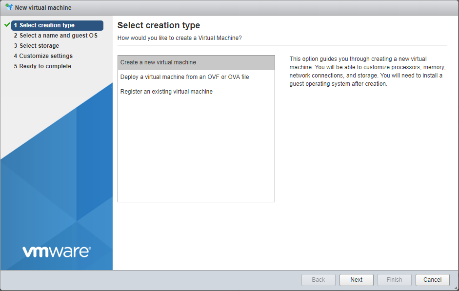  
    
2)  Select a name and guest O.S. (select CoreOS as Guest O.S.)  
    
    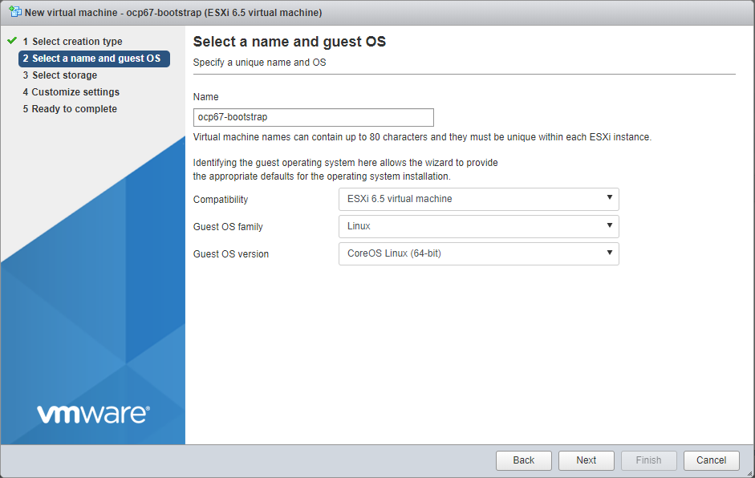  
    
3)  Select storage  
    
    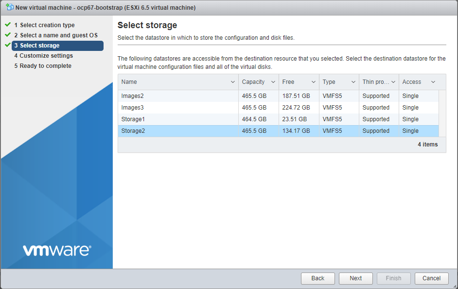  
    
4)  Customize settings:  
    - the default NIC should be connected to the Port Group ocp67 created earlier on the VMware host!  
    - make sure you set the MAC address manually to the value in [/etc/dhcp/dhcpd.conf](bastion/etc/dhcp/dhcpd.conf)!  
    - CPU, memory and storage are defined in the table in the Solution overview section  
    
    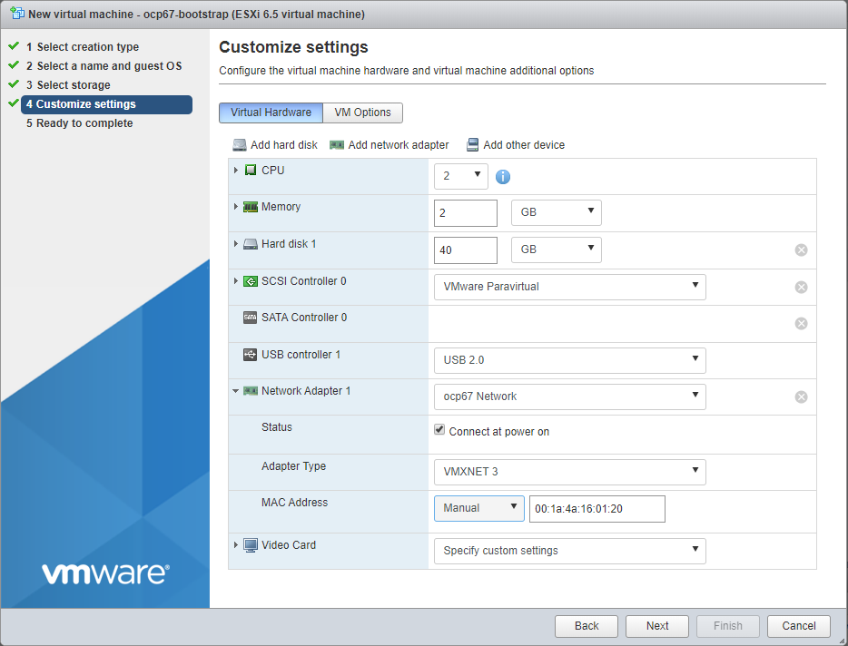  
    
5)  Finish the wizard and start the VM.  
    

Repeat these steps for the 3 master nodes and 2 compute nodes defined in the VM summary table above.
  

### Wait for the installation to complete
Execute the following command to check if the installation has completed:  
```sh
openshift-install wait-for bootstrap-complete --log-level debug
# You should get output similar to this after waiting for a while
DEBUG OpenShift Installer v4.2.8
DEBUG Built from commit 425e4ff0037487e32571258640b39f56d5ee5572
INFO Waiting up to 30m0s for the Kubernetes API at https://api.ocp67.i8c-lab-02.iconos.be:6443...
INFO API v1.14.6+dea7fb9 up
INFO Waiting up to 30m0s for bootstrapping to complete...
DEBUG Bootstrap status: complete
INFO It is now safe to remove the bootstrap resources
```
  
Once you see the above message you can remove the bootstrap VM.  
  
### Configure oc cli tool
From the bastion command line as root:  
  
```sh
# you can also add the following line to the ~/.bashrc file
export KUBECONFIG=~/ocp67/auth/kubeconfig
oc whoami
```
  
### Configuring storage for the image registry in non-production clusters
You must configure storage for the image registry Operator. Because this is non-production cluster, we set the image registry to an empty directory. Please note that all images are lost if you restart the registry.  
  
```sh
oc patch configs.imageregistry.operator.openshift.io cluster --type merge --patch '{"spec":{"storage":{"emptyDir":{}}}}'
# Check the status of the image-registry
oc get clusteroperator image-registry
```
  
# Next Steps
## hosts file
Edit your local hosts file (on windows = C:\Windows\System32\drivers\etc\hosts) to make the OpenShift environment accessible from your laptop. Add the following entry:  
```sh  
<ip address of the external connection on the bastion VM> console-openshift-console.apps.ocp67.i8c-lab-02.iconos.be oauth-openshift.apps.ocp67.i8c-lab-02.iconos.be grafana-openshift-monitoring.apps.ocp67.i8c-lab-02.iconos.be
```
  
## Open the OpenShift web console
The OpenShift Web Console is accessible at https://console-openshift-console.apps.ocp67.i8c-lab-02.iconos.be  
Login with the user `kubeadmin`. The password can be found on the bastion server in the file  `/root/ocp67/auth/kubeadmin-password`.

For more details check https://access.redhat.com/documentation/en-us/openshift_container_platform/4.2/html-single/web_console/index
  

# Troubleshooting
The most tricky part of the installation is getting the networking setup correct on the bastion server. Make sure DHCP, DNS and HAProxy servers are running and accessible from the cluster nodes. The bastion server also needs to route the traffic from the cluster nodes to the internet. The following commands can als be useful for troubleshooting:  
  
On the bastion server:
```sh
# Check 
systemctl status named-chroot
systemctl status tftp
systemctl status dhcpd
systemctl status matchbox
systemctl status haproxy
```

Login to cluster node CoreOS machines:  
```sh
ssh -i .ssh/id_rsa core@bootstrap.ocp67.i8c-lab-02.iconos.be
```
  
From the cluster node cli:
```sh
sudo su -
# Check if there is route from the cluster node to the internet
ping google.be
# Can the cluster nodes find the DNS server on the bastion server
nslookup google.be
# Check if the containers are running
crictl ps -a
```

## Resources
Check the following useful resources for tips on how to troubhleshoot the installation:
- https://github.com/openshift/installer/blob/master/docs/user/troubleshooting.md
- Use tcpdump to check communication between bastion and nodes: https://www.tcpdump.org/manpages/tcpdump.1.html
- Debugging Kubernetes nodes with crictl: https://kubernetes.io/docs/tasks/debug-application-cluster/crictl/

